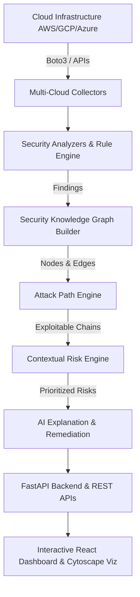

# 🛡️ CloudSentinel AI

[](https://github.com/Harshtech31/CloudSentinelAI/actions/workflows/lint.yml)
[](https://github.com/Harshtech31/CloudSentinelAI/actions/workflows/test.yml)
[](https://github.com/Harshtech31/CloudSentinelAI/actions/workflows/docker-build.yml)
[](https://opensource.org/licenses/MIT)
[](https://www.python.org/)
[](https://fastapi.tiangolo.com/)
[](https://react.dev/)

**CloudSentinel AI** is an advanced Cloud Security Posture Management (CSPM) and Automated Attack Path Analysis platform. It combines automated multi-cloud configuration collectors, graph-based attack path modeling (NetworkX/Neo4j), contextual risk calculation, and Large Language Model (LLM) powered remediation guidance into a single unified dashboard.

---

## 🏛️ System Architecture



---

## 👥 Team & Roles

| Member | Role | Key Domains |
|---|---|---|
| **Harshith** (Project Lead) | Lead Architect & Attack Engine | Graph Builder, Attack Engine, Infrastructure, CI/CD |
| **Teammate 1** | Backend Core | FastAPI, Database, Migrations, Authentication, API |
| **Teammate 2** | Cloud Collectors | AWS SDKs, Security Analyzers, CIS Benchmark Rules |
| **Teammate 3** | Risk Engine, AI & Frontend | Risk Scoring, LLM Explanations, React Dashboard |

---

## 🚀 Quick Start with Docker Compose

Ensure [Docker](https://docs.docker.com/get-docker/) and [Docker Compose](https://docs.docker.com/compose/) are installed.

```bash
# 1. Clone repository
git clone https://github.com/Harshtech31/CloudSentinelAI.git
cd CloudSentinelAI

# 2. Copy environment template
cp .env.example .env

# 3. Start all services (PostgreSQL, Backend API, Frontend)
docker compose up --build -d

# 4. Check container health
docker compose ps
```

- 🌐 **Frontend Dashboard**: [http://localhost:5173](http://localhost:5173)
- 🔌 **Backend API**: [http://localhost:8000](http://localhost:8000)
- 📖 **Swagger OpenAPI Docs**: [http://localhost:8000/docs](http://localhost:8000/docs)
- ❤️ **Health Check**: [http://localhost:8000/api/v1/health](http://localhost:8000/api/v1/health)

---

## 💻 Local Development Setup

### Backend (Python 3.11+)

```bash
cd backend

# Create virtual environment
python3 -m venv venv
source venv/bin/activate  # On Windows: venv\Scripts\activate

# Install dependencies
pip install -r requirements.txt

# Start backend server with auto-reload
uvicorn app.main:app --host 0.0.0.0 --port 8000 --reload
```

### Frontend (Node 20+)

```bash
cd frontend

# Install dependencies
npm install

# Start Vite dev server
npm run dev
```

---

## 🧪 Running Tests & Quality Checks

```bash
# Run pytest test suite
cd backend
pytest -v

# Run linting with Ruff
ruff check .
ruff format --check .
```

---

## 📁 Repository Structure

```
.
├── .github/workflows/       # GitHub Actions CI/CD workflows
├── backend/
│   ├── app/
│   │   ├── ai/              # LLM providers & explanation generators
│   │   ├── analyzers/       # Misconfiguration & CIS compliance rules
│   │   ├── api/v1/          # FastAPI REST endpoints
│   │   ├── attack_engine/   # Attack graph & multi-hop path finder
│   │   ├── auth/            # JWT, password hashing & RBAC
│   │   ├── collectors/      # Multi-cloud collectors (AWS/GCP/Azure)
│   │   ├── core/            # Config, logging, exceptions, security
│   │   ├── database/        # SQLAlchemy base, models, migrations
│   │   ├── graph/           # Knowledge graph builder & NetworkX traversals
│   │   ├── reports/         # JSON/CSV/HTML/PDF report generators
│   │   └── risk_engine/     # Contextual risk calculators
│   ├── Dockerfile
│   ├── pyproject.toml
│   └── requirements.txt
├── frontend/
│   ├── src/                 # React 18 + Vite + TypeScript application
│   ├── package.json
│   └── Dockerfile
├── docker-compose.yml
├── .env.example
├── LICENSE
└── README.md
```

---

## 📄 License

This project is licensed under the MIT License — see the [LICENSE](LICENSE) file for details.
